# 社团管理系统  
Association Admin

### 项目成员  

<table>
    <tr>
        <th>姓名</th>
        <th>学号</th>
        <th>备注</th>
    </tr>
    <tr>
        <td>傅凯琪</td>
        <td>2015210405075</td>
        <td>组长</td>
    </tr>
    <tr>
        <td>徐韬</td>
        <td>2015210405003</td>
        <td></td>
    </tr>
    <tr>
        <td>岑焕亚</td>
        <td>2015210405013</td>
        <td></td>
    </tr>
    <tr>
        <td>林一凡</td>
        <td>2015210405019</td>
        <td></td>
    </tr>
</table>

### 项目描述

　　实现一个社团管理系统`PC端` ，提供社团管理员和社员的信息交流，包括活动发布与活动报名，入社申请，资料下载等功能。  
　　整体使用MEAN架构，前端Angularjs框架，后端Express框架，数据库采用Mongodb，Nodejs作为运行平台。

### 功能模块
1. 社团管理员
    - 活动
        - 发布活动
            - 社团内部
            - 公开
        - 查看活动报名人员
        - 活动讨论
    - 个性空间
        - 社团介绍
        - 活动展示
        - 入社申请
    - 社员管理
        - 查看
    - 资料
        - 上传
    
1. 会员
    - 活动
        - 活动报名
        - 查看活动报名人员
        - 活动讨论
    - 个性空间
        - 社团介绍
        - 活动展示
        - 入社申请
    - 资料
        - 下载
    
    
### 数据模型
目录：/models
1. 用户 UserAccount
    - studentID: String,                           //学号
    - pwd: String,                                 //密码
    - email: String,                               //邮箱
    - name: String,                                //姓名
    - nickname: String,                            //昵称
    - sex: String,                                 //性别 m:男 f:女
    - admins: [ObjectId],                        //有管理权限的社团
    - associations: [ObjectId],                  //加入的社团
    - mobile: String,                              //手机
    - headimage: String,                           //头像
    - createtime: {type: Date, default: Date.now}, //创建时间
    - attendedActivity:[{                          //报名活动
    - 　　type: ObjectId,
    - 　　unique:true
    - }]
1. 社团 Association
    - name: String,          //社团名
    - proprieterId: ObjectId,//社长
    - admins: [ObjectId],    //管理员（社长，部长）
    - members:[ObjectId],    //普通社员
    - logoimage: String,     //logo
    - introduction: String,  //社团介绍
    - application:[{
    - 　　statement:String,
    - 　　memberId:ObjectId
    - }]
1. 社团活动 Activity
    - title: String,           //活动标题
    - content: String,         //活动内容
    - time: Date,              //活动时间
    - place: String,           //活动地点
    - associationId: ObjectId, //承办社团
    - associationName: String, //承办社团名字
    - attendingStudent:[{       //参加学生ID
    - 　　type: ObjectId,
    - 　　unique:true
    - }]
1. 社团动态 News
    - title: String,          //新闻标题
    - content: String,        //新闻内容
    - time: {                 //新闻时间
    - 　　type: Date,
    - 　　default:Date.now
    - },
    - associationId: ObjectId,//承办社团
    - imgSrc: String,         //封面图片的img标签的src
1. 社团文件 File
    - 12
    - title: String,          //资料标题
    - content: String,        //资料描述
    - url:String,             //资料位置
    - time: {                 //上传时间
    - 　　type: Date,
    - 　　default:Date.now
    - },
    - associationId: ObjectId,//所属社团
### 界面设计
登陆
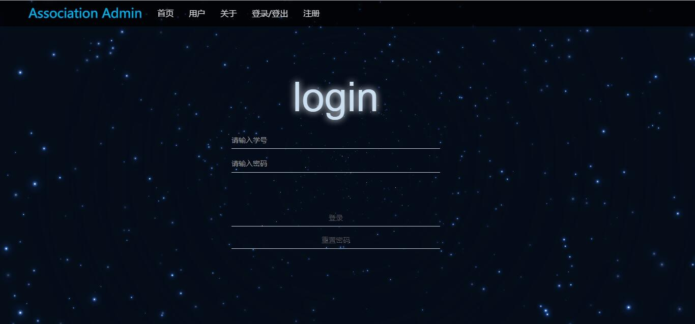
注册
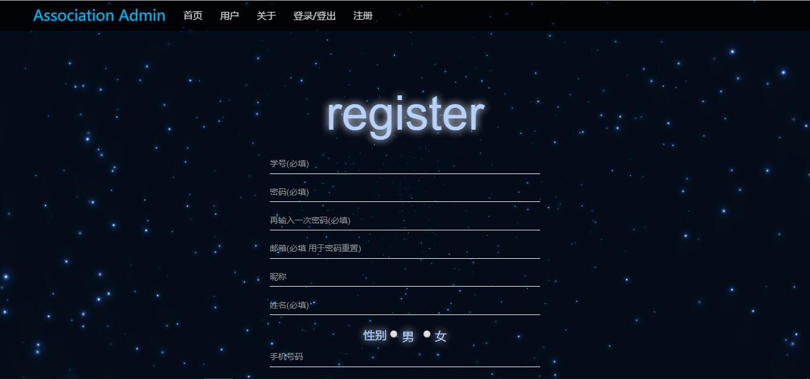
主界面-活动列表
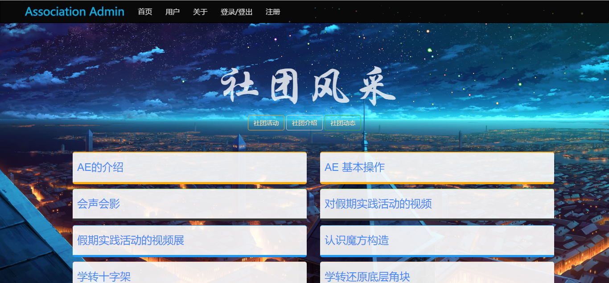
主界面-社团介绍列表
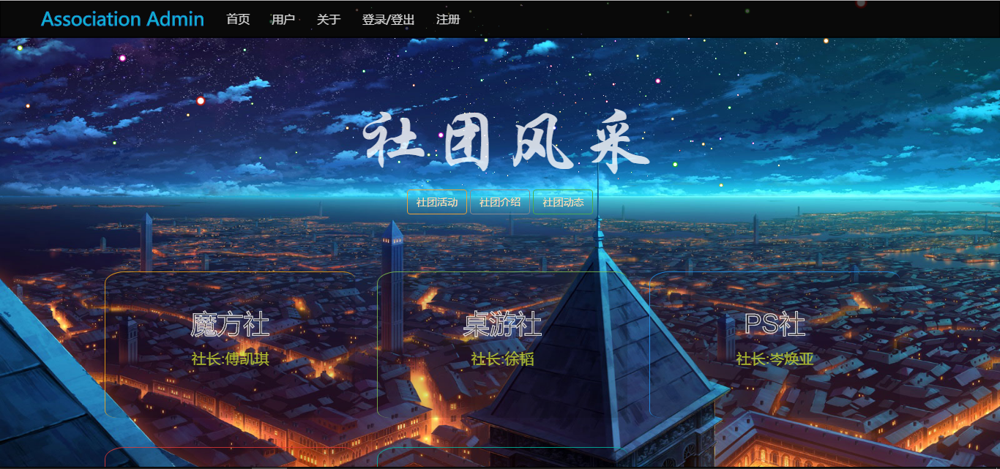
主界面-动态列表
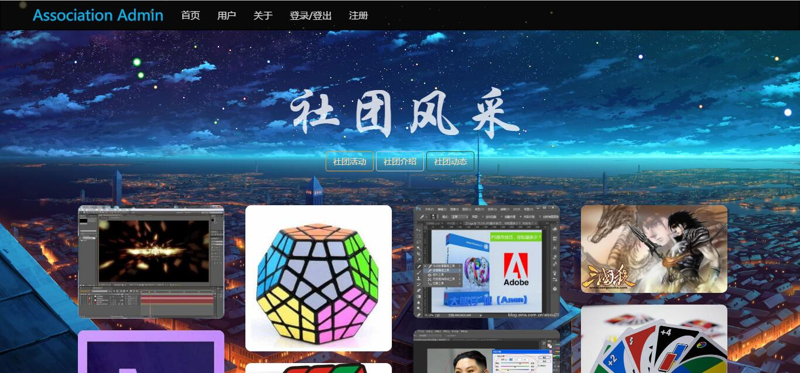
用户主页
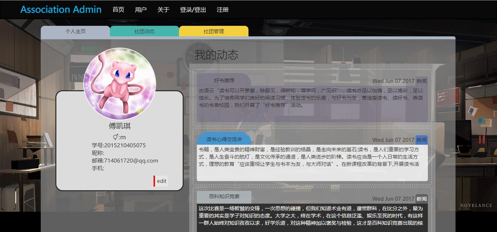
用户加入的社团及活动
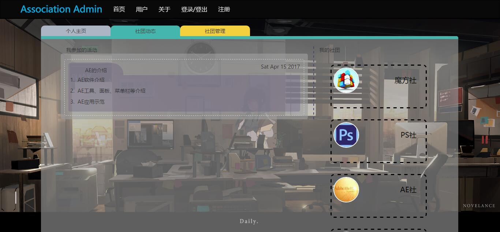
用户社团管理
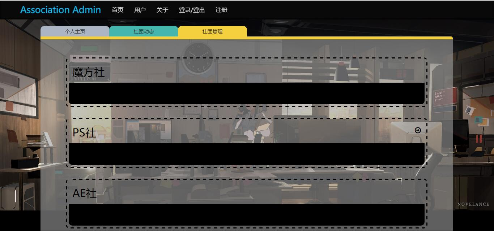
社团资料管理
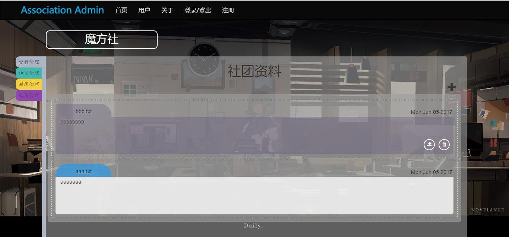
社团活动管理
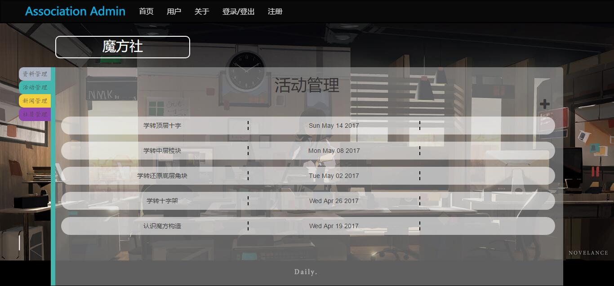
社团新闻管理
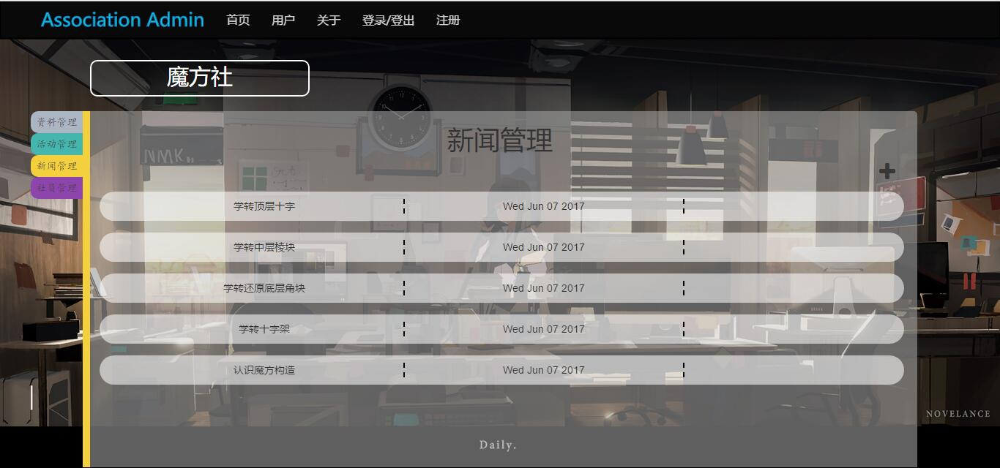
社团社员管理
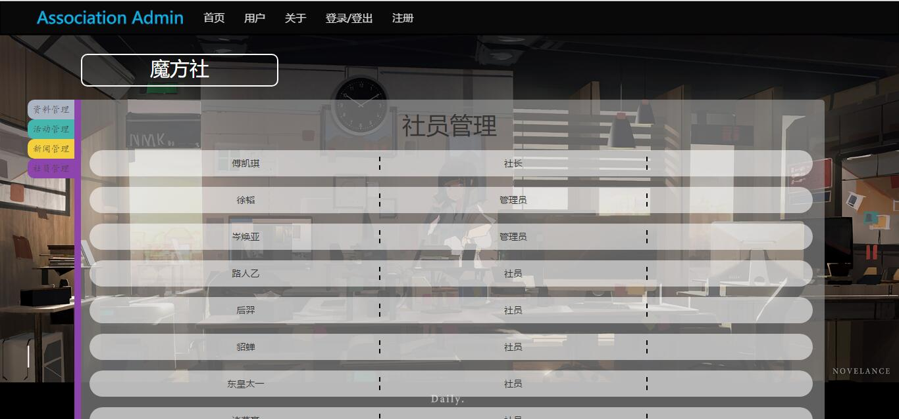
社团主页
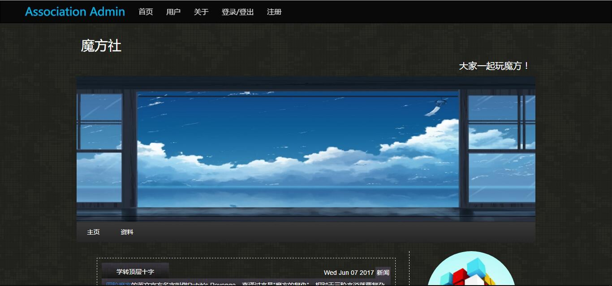
活动详情
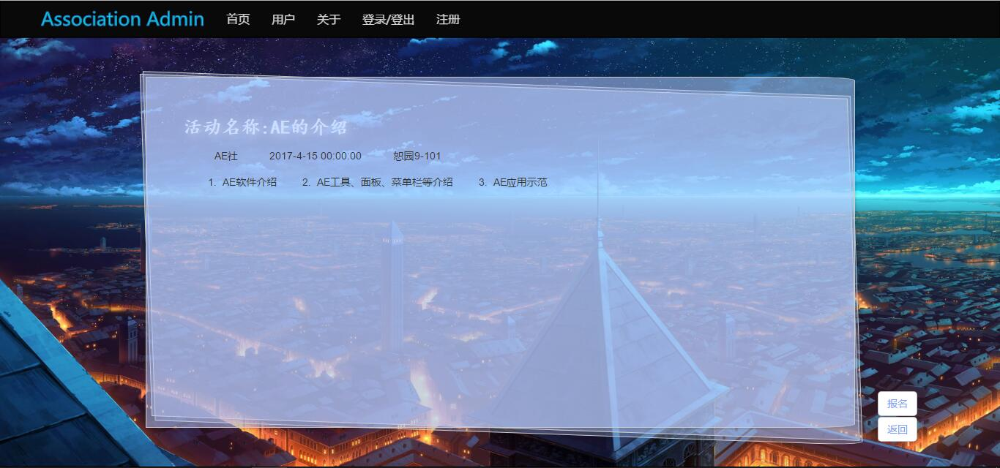
活动编辑
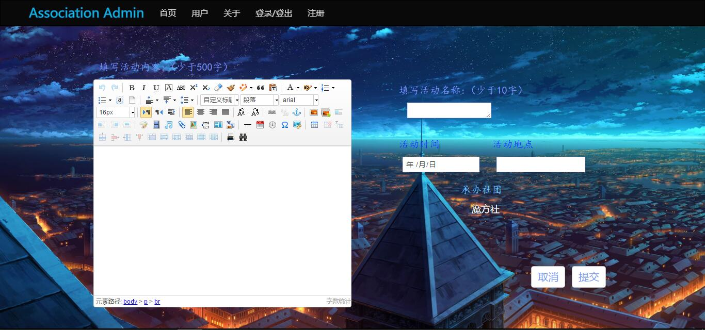
新闻编辑
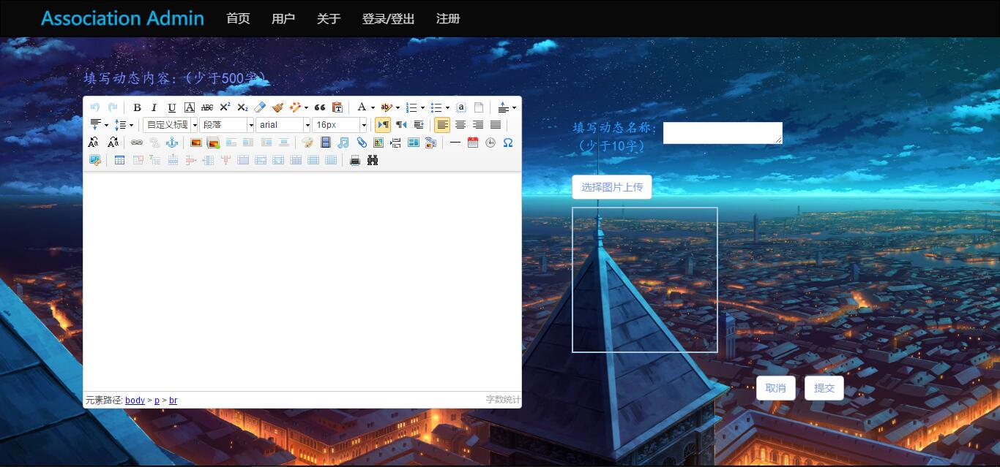