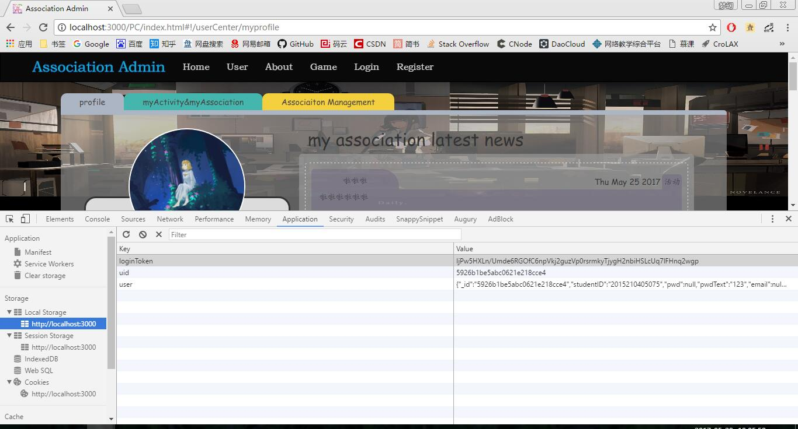

部分页面访问需要登录，以下是已经实现的
1. nav的user下的所有页面（在userCenterCtrl和associationManagementCtrl加了权限验证
1. clubHomepage下的download（在clubDownloadCtrl加了权限验证）

权限验证代码：
```javascript
let user = SystemService.getUser();
if (!user) {
    swal('用户未登录!', '请登录', 'error');
    $state.go('login');
}
```

用户登录或者注册后便会设置SystemService的user，代码如下
```javascript
localStorage.user = JSON.stringify(data.returnValue.user);
SystemService.setUser(data.returnValue.user);
localStorage.loginToken = data.returnValue.loginToken;
SystemService.setLoginToken(data.returnValue.loginToken);
localStorage.uid = data.returnValue.user._id;
SystemService.setUID(data.returnValue.user._id);
```
设置了`SystemService`里面的`user` `uid` `loginToken`  
获取的代码主要是 `SystemService.getUser` `SystemService.getUID`

cookie,localStorage,sessionStorage等可以理解为一个网页维护的数据库  
查看的方式是chrome→f12→Application→Storage  
因为登出功能暂时还没做，所以要登出就清除上面那三项内容再刷新页面就好了  


解释完毕，以下是需要修改的  
1. 根据不同登录者显示不同的user页面
1. 根据不同登录者显示不同的相关页面（活动啊新闻啊以及管理页面（管理页面可以ng-if判断user.admins数组是不是空来显示或隐藏那个按钮））
1. user页面的edit按钮实现一下，然后做一个上传头像的按钮，做个跳转，具体功能我会实现
1. 社团管理页面添加新建、编辑、删除按钮，具体我会实现（后两者好像样式有了，把ng-click加上去就好了...）
